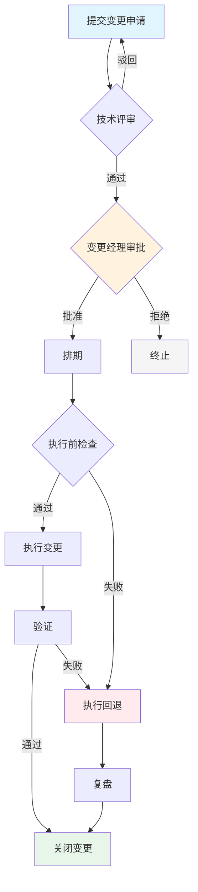

# 生产变更审批 SOP

## 1. 生产变更定义

### 1.1 适用范围

本 SOP 适用于所有影响**生产环境**的变更操作，特指风险等级为 **L3（高风险）** 和 **L4（严重风险）** 的变更。

> **依赖说明**：L0-L4 风险等级的具体定义见 `change-management-sop` Skill。概要如下：
>
> | 等级 | 名称 | 影响范围 | 示例 |
> |------|------|----------|------|
> | L0 | 无风险变更 | 无业务影响 | 文档更新、只读查询 |
> | L1 | 低风险变更 | 单实例、可快速回退 | 配置参数调整 |
> | L2 | 中风险变更 | 有限影响、有回退方案 | 非核心服务重启 |
> | **L3** | **高风险变更** | **影响核心功能、需灰度** | **数据库 DDL、核心服务升级** |
> | **L4** | **严重风险变更** | **可能造成重大故障** | **全量架构变更、数据迁移、跨版本升级** |

### 1.2 L3 变更判定条件

符合以下任一条件即判定为 L3：

- 变更影响核心业务链路（支付、登录、订单等）
- 变更涉及数据库结构修改（DDL、索引变更）
- 变更涉及多个服务间依赖关系调整
- 变更无法在 30 分钟内回退
- 变更涉及腾讯云生产环境核心资源（CLB、CVM 关键实例、CDB 主库）

### 1.3 L4 变更判定条件

符合以下任一条件即判定为 L4：

- 变更影响全部用户或全部实例
- 变更涉及数据迁移（数据量 > 100GB 或影响 > 100 万条记录）
- 变更涉及数据库主库切换、分库分表改造
- 变更涉及跨版本核心服务升级（如 MySQL 5.7 → 8.0、Nginx 1.x → 2.x）
- 变更新增或修改生产环境网络架构（VPC、安全组、VPN）
- 变更无经过完整灰度验证

---

## 2. 审批流程

### 2.1 流程总览

```
┌──────────┐    ┌──────────┐    ┌──────────┐    ┌──────────┐    ┌──────────┐    ┌──────────┐    ┌──────────┐
│  ① 提交  │ →  │  ② 技术  │ →  │  ③ 变更  │ →  │  ④ 排期  │ →  │  ⑤ 执行  │ →  │  ⑥ 验证  │ →  │  ⑦ 关闭  │
│          │    │  评审    │    │  经理审批 │    │          │    │          │    │          │    │          │
└──────────┘    └──────────┘    └──────────┘    └──────────┘    └──────────┘    └──────────┘    └──────────┘
```

### 2.2 步骤详情

#### ① 提交变更申请

**提交人**：任意工程师
**系统**：[变更管理平台/工单系统]
**必填内容**：

| 字段 | 说明 |
|------|------|
| 变更标题 | 简明扼要描述变更内容 |
| 变更类型 | 选择类型：配置变更/代码发布/数据库变更/基础设施变更/其他 |
| 风险等级 | L3 或 L4（按 1.2/1.3 节判定） |
| 变更描述 | 详细说明变更目的、范围、影响 |
| 涉及系统 | 列出所有受影响的服务/模块 |
| 变更方案 | 操作步骤、脚本、配置变更内容 |
| 回退方案 | 见第 4 节模板 |
| 验证方案 | 执行后如何验证变更成功 |
| 计划时间 | 建议变更窗口期 |
| 腾讯云资源 | 涉及的具体云资源列表（实例 ID、CLB ID 等） |

**检查命令示例：**

```bash
# 检查涉及云资源的变更是否已在 CMDB 中登记
echo "🔍 请在提交前确认以下腾讯云资源已登记到 CMDB:"
# 示例：列出特定 CVM 信息
# tccli cvm DescribeInstances --InstanceIds '["ins-xxxxxx"]'

# 检查关联的监控告警是否已配置
echo "🔍 请确认变更涉及的服务存在对应的监控告警规则"
```

#### ② 技术评审

**评审人**：团队技术负责人 / 资深工程师（至少 1 人）
**评审内容**：

- [ ] 变更方案是否合理、完整
- [ ] 操作步骤是否可执行、无歧义
- [ ] 回退方案是否可行、已验证
- [ ] 验证方案是否可衡量、可自动化
- [ ] 是否已评估变更影响（业务影响 + 技术影响）
- [ ] 涉及数据库变更是否已 review SQL
- [ ] 涉及腾讯云资源变更是符合安全最佳实践（最小权限原则）
- [ ] 变更是否已有灰度/分批策略

**评审结论**：

- ✅ 通过 → 进入变更经理审批
- ❌ 驳回 → 退回修改，附驳回原因
- ⏸️ 需要补充信息 → 标记待补充

**评审人检查命令示例：**

```bash
# 如果是数据库 DDL 变更，检查 SQL 风险
echo "🔍 SQL 变更审查要点:"
echo "  1. 是否包含 DROP TABLE/ALTER TABLE 等高危操作？"
echo "  2. 是否已有备份？"
echo "  3. 主从延迟是否在可接受范围？"
# tccli cdb DescribeDBInstanceInfo --InstanceId cdb-xxxxxx

# 检查变更涉及的服务健康状态基线
echo "🔍 检查服务当前健康基线:"
# curl -s http://localhost:9090/metrics | grep -E "up|health|status"
```

#### ③ 变更经理审批

**审批人**：变更经理（由团队轮值或指定）
**审批条件**：

- [ ] 技术评审已通过
- [ ] 变更未安排在禁止变更窗口期（见第 3 节）
- [ ] 回退方案完整且已验证
- [ ] 变更已获得相关干系人知悉（通知业务方、客服团队等）
- [ ] 涉及外部依赖的变更已确认外部团队就绪

**审批结论**：

- ✅ 批准 → 进入排期
- ❌ 拒绝 → 附拒绝原因，终止流程
- ⏸️ 暂缓 → 指定暂缓原因和条件

#### ④ 排期

**执行人**：变更调度员 / 值班 SRE
**排期规则**：

- 优先安排在允许变更窗口期（见 3.1 节）
- L3 变更至少提前 **4 小时** 通知干系人
- L4 变更至少提前 **24 小时** 通知干系人
- 同一时间窗口最多允许 **2 个** L3+ 变更并行
- 腾讯云生产环境变更优先在 **业务低峰期** 执行

**排期输出**：

```
变更编号: CHG-YYYYMMDD-001
执行时间: 2026-06-18 03:00 - 04:00 (UTC+8)
执行人: 张三 (主) / 李四 (备)
通知列表: oncall@team.com, ops@company.com
```

#### ⑤ 执行

**执行前检查清单（Checklist）：**

```bash
#!/bin/bash
# production-change-preflight.sh — 执行前巡检脚本

echo "=== 生产变更执行前检查 ==="

# 1. 确认变更获得最终批准
echo "[✓] 变更已获变更经理批准"

# 2. 确认在允许变更窗口期内
CURRENT_HOUR=$(date +%H)
if [ "$CURRENT_HOUR" -ge 9 ] && [ "$CURRENT_HOUR" -lt 18 ]; then
    echo "[✓] 当前时间在允许变更窗口期内"
else
    echo "[✗] 当前不在允许变更窗口期（09:00-18:00），需紧急变更审批！"
    exit 1
fi

# 3. 确认当前无 P0/P1 故障
# 假设有健康检查 API
# HEALTH_STATUS=$(curl -s http://monitor.internal/current-alerts?severity=P0,P1)
# if echo "$HEALTH_STATUS" | grep -q "alert"; then
#     echo "[✗] 存在 P0/P1 未恢复故障，禁止执行变更！"
#     exit 1
# fi
echo "[✓] 当前无 P0/P1 故障（需人工确认）"

# 4. 腾讯云资源状态检查（需配置 tccli）
echo "[?] 请人工确认以下腾讯云资源状态正常:"
echo "    - CVM: $TC_CVM_IDS"
echo "    - CLB: $TC_CLB_IDS"
echo "    - CDB: $TC_CDB_IDS"
# tccli cvm DescribeInstancesStatus --InstanceIds '["ins-xxxxxx"]'
# tccli cdb DescribeDBInstanceInfo --InstanceId cdb-xxxxxx

# 5. 确认备份已完成
echo "[✓] 变更前备份已完成（如适用）"

# 6. 确认回退方案就绪
echo "[✓] 回退方案已就绪，执行人已熟悉步骤"

# 7. 通知干系人变更即将开始
echo "[✓] 已通过 IM/邮件通知干系人"

echo "=== 检查完成，可开始执行变更 ==="
```

**执行纪律：**

- 严格按照变更方案中的步骤逐一执行
- **本地执行 + 远程腾讯云操作**，先本地确认再远程执行
- 每一步操作前先打印操作描述
- 每一步操作后立即验证结果
- 遇到异常立即暂停，执行回退方案
- **生产环境操作必须人工确认**，不允许全自动化无人值守

**执行记录模板：**

```markdown
## 执行记录

| 时间 | 步骤 | 操作人 | 结果 |
|------|------|--------|------|
| 03:00 | 步骤 1：备份数据库 | 张三 | ✅ 成功 |
| 03:05 | 步骤 2：执行 DDL | 张三 | ✅ 成功 |
| 03:15 | 步骤 3：重启服务 | 李四 | ✅ 成功 |
```

#### ⑥ 验证

见第 5 节「执行后验证清单」。

#### ⑦ 关闭

**关闭条件：**

- [ ] 验证清单全部通过
- [ ] 变更后观察期（L3：30 分钟，L4：60 分钟）无异常告警
- [ ] 腾讯云资源监控指标正常（CPU、内存、连接数、延迟等）
- [ ] 业务验证通过（如有灰度流量验证）
- [ ] 变更记录已完整填写并归档

**关闭操作：**

```bash
# 归档变更记录
echo "变更 CHG-YYYYMMDD-001 已关闭"
echo "变更结果: 成功/失败/回退"
echo "实际执行时间: 2026-06-18 03:00 - 03:45"
echo "变更后观察期结束时间: 2026-06-18 04:45"
```

---

## 3. 变更窗口期

### 3.1 允许变更时间段

| 时段 | L3 | L4 | 说明 |
|------|:--:|:--:|------|
| 周一至周五 09:00-12:00 | ✅ | ❌ | 低峰期，适合 L3 |
| 周一至周五 13:00-18:00 | ✅ | ❌ | 一般窗口 |
| 周一至周五 18:00-21:00 | ⚠️ 审批从严 | ❌ | 非紧急不建议 |
| 周一至周五 21:00-09:00 | ❌ | ❌ | 禁止变更（除非紧急） |
| 周六、周日 全天 | ❌ | ❌ | 禁止变更（除非紧急） |
| 法定节假日 全天 | ❌ | ❌ | 禁止变更 |

### 3.2 禁止变更时间段

- **法定节假日前后 1 天**：禁止所有 L3/L4 变更
- **大促/运营活动期间**：禁止所有非必要变更
- **重要发布日前 24 小时**：禁止 L4 变更
- **P0/P1 故障未恢复期间**：禁止所有变更
- **腾讯云计划维护窗口**：禁止与其冲突的变更

### 3.3 紧急变更快速通道

**适用条件**：线上故障修复、安全漏洞修复、业务紧急需求

**快速通道流程：**

```
1. 发起人提交紧急变更申请（标记 URGENT）
2. 值班 SRE 在 15 分钟内完成技术评审
3. 变更经理在 15 分钟内审批（可电话/IM 确认）
4. 若变更经理 15 分钟内无法响应，自动升级至技术总监
5. 执行变更（同标准流程步骤 ⑤）
6. 24 小时内补全完整变更记录
```

**紧急变更审批命令示例：**

```bash
echo "🚨 紧急变更快速通道审批"

# 1. 确认紧急变更条件
echo "紧急变更原因: $URGENT_REASON"
echo "影响范围: $IMPACT_SCOPE"

# 2. 记录审批人确认
echo "技术评审人: $TECH_REVIEWER"
echo "审批时间: $(date +'%Y-%m-%d %H:%M:%S')"

# 3. 记录审批结果
echo "变更经理审批: 批准/拒绝"
echo "审批人: $CHANGE_MANAGER"

# 4. 记录升级路径（如适用）
echo "如需升级: 已通知技术总监 $TECH_DIRECTOR"
```

**紧急变更后补全清单：**

- [ ] 24 小时内补充完整变更方案文档
- [ ] 24 小时内补充回退方案
- [ ] 48 小时内完成事后复盘（Postmortem）
- [ ] 记录紧急变更原因，评估是否能通过常规流程规避

---

## 4. 回退方案模板

### 4.1 回退方案模板

```yaml
# 回退方案模板
change_id: CHG-YYYYMMDD-001
change_title: "变更标题"

rollback:
  trigger_condition: "变更执行中遇到以下任一情况立即执行回退：
    1. 变更步骤执行失败且无法在 5 分钟内修复
    2. 验证指标异常（延迟上升 > 20%、错误率 > 0.1%）
    3. 腾讯云服务出现异常告警（CPU 持续 > 90%、连接池耗尽等）
    4. 业务方反馈异常且确认与本次变更相关
    5. 操作人确认回退（无需等待审批）"

  rollback_steps:
    - step: 1
      description: "停止变更操作"
      command: "立即停止当前步骤，不继续执行后续步骤"
      expected_result: "变更进程终止"
      estimated_time: "1 分钟"

    - step: 2
      description: "执行配置回退"
      command: "将配置恢复到变更前的备份版本"
      # 示例: cp /etc/nginx/nginx.conf.bak.20260617 /etc/nginx/nginx.conf
      expected_result: "配置恢复到变更前状态"
      estimated_time: "2 分钟"

    - step: 3
      description: "回滚代码版本"
      command: "将服务版本回退到变更前的版本号"
      # 示例: kubectl rollout undo deployment/my-service -n production
      # 或: git checkout TAG_PREVIOUS && docker compose up -d
      expected_result: "服务代码回退到前一版本"
      estimated_time: "3 分钟"

    - step: 4
      description: "数据库回退（如适用）"
      command: "执行逆向 SQL 或从备份恢复"
      # 示例: mysql -h $DB_HOST -u $DB_USER -p$DB_PASS < rollback.sql
      expected_result: "数据库结构/数据恢复"
      estimated_time: "10 分钟"

    - step: 5
      description: "服务重启并验证"
      command: "重启受影响服务，确认服务健康"
      # 示例: systemctl restart my-service && systemctl status my-service
      expected_result: "服务正常运行"
      estimated_time: "5 分钟"

    - step: 6
      description: "通知干系人"
      command: "通过 IM/邮件通知相关人员变更已回退"
      expected_result: "干系人已获知回退情况"
      estimated_time: "2 分钟"

  rollback_validation:
    - "确认所有服务恢复正常运行"
    - "确认无异常告警"
    - "确认业务指标恢复到变更前水平（可通过 Grafana 对比）"
    - "确认腾讯云资源状态正常"

  rollback_record:
    - "记录回退时间、触发原因、执行步骤"
    - "将回退记录关联到变更单"
    - "安排事后复盘会议"
```

### 4.2 回退方案检查命令

```bash
#!/bin/bash
# rollback-check.sh — 回退方案就绪检查

echo "=== 回退方案就绪检查 ==="

# 回退脚本存在性检查
ROLLBACK_SCRIPT="./rollback/${CHANGE_ID}.sh"
if [ -f "$ROLLBACK_SCRIPT" ]; then
    echo "[✓] 回退脚本存在: $ROLLBACK_SCRIPT"
    # 语法检查
    bash -n "$ROLLBACK_SCRIPT" && echo "[✓] 回退脚本语法正确"
else
    echo "[✗] 回退脚本不存在！需要在变更前准备"
fi

# 数据库备份检查（如适用）
# BACKUP_FILE="/data/backup/${CHANGE_ID}_pre.sql.gz"
# if [ -f "$BACKUP_FILE" ]; then
#     echo "[✓] 数据库备份存在: $BACKUP_FILE ($(du -sh $BACKUP_FILE | cut -f1))"
# fi

# 配置备份检查
CONFIG_BACKUP="./backup/${CHANGE_ID}_config.bak"
if [ -f "$CONFIG_BACKUP" ]; then
    echo "[✓] 配置备份存在"
else
    echo "[!] 配置备份未找到，请在变更前手动备份"
fi

echo "=== 回退方案检查完成 ==="
```

---

## 5. 执行后验证清单

### 5.1 基础验证清单

```yaml
change_id: CHG-YYYYMMDD-001
validation_checklist:
  服务健康检查:
    - check: "服务进程正常运行"
      command: "systemctl status my-service || docker ps | grep my-service"
      expected: "active (running) / Up 状态"
  网络连通性:
    - check: "服务端口监听正常"
      command: "ss -tlnp | grep :8080"
      expected: "LISTEN 状态"
    - check: "健康检查端点正常"
      command: "curl -s -o /dev/null -w '%{http_code}' http://localhost:8080/health"
      expected: "200"
  指标检查:
    - check: "服务 CPU 使用率正常"
      command: "top -bn1 | grep my-service | awk '{print \$9}'"
      expected: "< 80%"
    - check: "服务内存使用率正常"
      command: "free -m | awk 'NR==2{printf \"%.2f%%\", \$3*100/\$2}'"
      expected: "< 90%"
  日志检查:
    - check: "无 ERROR 级别日志"
      command: "journalctl -u my-service --since '5 minutes ago' | grep -i error | wc -l"
      expected: "0"
    - check: "无异常堆栈输出"
      command: "journalctl -u my-service --since '5 minutes ago' | grep -i exception | wc -l"
      expected: "0"

  腾讯云资源检查:
    - check: "CVM 实例状态正常"
      command: "# tccli cvm DescribeInstancesStatus --InstanceIds '[\"ins-xxxxxx\"]' | jq '.InstanceStatusSet[].InstanceState'"
      expected: "RUNNING"
    - check: "CLB 健康检查正常"
      command: "# tccli clb DescribeTargetHealth --LoadBalancerIds '[\"lb-xxxxxx\"]' | jq '.LoadBalancerHealthSet[].ListenerSet[].HealthStatus'"
      expected: "true"
    - check: "CDB 实例状态正常"
      command: "# tccli cdb DescribeDBInstanceInfo --InstanceId cdb-xxxxxx | jq '.Status'"
      expected: "1（运行中）"

  业务验证:
    - check: "关键业务流程通过冒烟测试"
      command: "# 执行业务冒烟测试脚本"
      expected: "全部通过"
    - check: "错误率未上升"
      expected: "对比变更前后 5 分钟错误率，上升 < 0.1%"
    - check: "响应延迟无恶化"
      expected: "对比变更前后 P99 延迟，上升 < 10%"
```

### 5.2 验证执行命令

```bash
#!/bin/bash
# post-change-validation.sh — 变更后验证脚本

CHANGE_ID="${1:-CHG-UNKNOWN}"
echo "=== 变更后验证: $CHANGE_ID ==="
echo "验证时间: $(date +'%Y-%m-%d %H:%M:%S')"

PASS=0
FAIL=0
TOTAL=0

run_check() {
    local name="$1"
    local cmd="$2"
    local expected="$3"
    TOTAL=$((TOTAL + 1))

    echo -n "[检查 $TOTAL] $name..."
    # 实际执行检查（此处为占位，需替换为真实命令）
    # result=$(eval "$cmd" 2>&1)
    echo "（需人工执行: $cmd）"
    echo "  期望结果: $expected"
    echo -n "  结果 [通过/失败]: "
    read -r user_result
    if [ "$user_result" = "通过" ]; then
        PASS=$((PASS + 1))
    else
        FAIL=$((FAIL + 1))
    fi
}

echo ""
echo "--- 服务健康检查 ---"
run_check "服务进程" "systemctl status my-service" "active (running)"

echo ""
echo "--- 腾讯云资源检查 ---"
run_check "CVM 状态" "tccli cvm DescribeInstancesStatus --InstanceIds '[\"ins-xxxxxx\"]'" "RUNNING"

echo ""
echo "--- 业务验证 ---"
run_check "错误率" "（查看 Grafana 面板）" "错误率 < 0.1%"

echo ""
echo "=== 验证结果 ==="
echo "总检查项: $TOTAL | 通过: $PASS | 失败: $FAIL | 通过率: $((PASS * 100 / TOTAL))%"
if [ "$FAIL" -gt 0 ]; then
    echo "⚠️ 存在失败的检查项，请确认是否需要回退！"
    exit 1
else
    echo "✅ 全部检查通过"
fi
```

---

## 6. 变更审批记录的审计追踪

### 6.1 审计记录内容

每次变更的完整审批记录应包含以下信息，并**不可篡改地**保存至少 **1 年**：

| 审计字段 | 说明 | 示例 |
|----------|------|------|
| 变更编号 | 唯一标识 | CHG-20260617-001 |
| 变更标题 | 变更描述 | 订单数据库索引优化 |
| 申请人 | 发起人姓名 | 张三 |
| 变更类型 | 配置/代码/数据库/基础设施 | 数据库变更 |
| 风险等级 | L3 / L4 | L3 |
| 涉及系统 | 受影响的系统列表 | order-service, payment-db |
| 变更方案 | 完整的变更操作步骤 | （Markdown 文档链接） |
| 回退方案 | 完整的回退操作步骤 | （Markdown 文档链接） |
| 技术评审人 | 评审人姓名 + 评审时间 | 李四, 2026-06-17 14:00 |
| 技术评审结论 | 通过/驳回/待补充 | 通过 |
| 变更经理 | 审批人姓名 | 王五 |
| 变更经理审批结论 | 批准/拒绝/暂缓 | 批准 |
| 审批时间 | 审批完成时间 | 2026-06-17 15:00 |
| 计划执行时间 | 排定的执行时间段 | 2026-06-18 03:00-04:00 |
| 实际执行时间 | 实际执行时间段 | 2026-06-18 03:05-03:45 |
| 执行人 | 执行操作人 | 张三 |
| 验证人 | 验证操作人 | 李四 |
| 验证结果 | 通过/失败/部分通过 | 通过 |
| 变更结果 | 成功/失败/回退 | 成功 |
| 关单人 | 关闭变更记录人 | 赵六 |
| 关闭时间 | 变更关闭时间 | 2026-06-18 04:50 |
| 备注 | 其他说明 | 无异常 |

### 6.2 审计记录存储

- **主存储**：变更管理平台（内部工单系统）
- **备份存储**：版本控制系统（Git 仓库），每次变更归档一个 Markdown 文件
- **不可篡改性**：采用 Git 签名提交 + 定期快照校验

### 6.3 审计检查命令

```bash
#!/bin/bash
# audit-export.sh — 导出并验证变更审计记录

echo "=== 变更审计记录导出 ==="

# 1. 导出指定时间范围的变更记录
EXPORT_DATE="${1:-2026-06-17}"
echo "导出日期: $EXPORT_DATE"

# 从变更管理平台导出（示例 API 调用）
# curl -s "https://change.internal/api/audit?date=$EXPORT_DATE&format=json" \
#   -H "Authorization: Bearer $CHANGE_API_TOKEN" \
#   -o "./audit/${EXPORT_DATE}_changes.json"

# 2. 统计变更数量
# jq '. | length' "./audit/${EXPORT_DATE}_changes.json"
echo "变更总数:（需查询变更管理平台）"

# 3. 检查审批完整性
echo ""
echo "--- 审计完整性检查 ---"
echo "检查项: 所有 L3/L4 变更是否都经过了完整审批流程"
# jq -r '.[] | select(.risk_level == "L3" or .risk_level == "L4") |
#   "\(.change_id): 技术评审=\(.tech_review.status), 经理审批=\(.manager_approval.status)"' \
#   "./audit/${EXPORT_DATE}_changes.json"

# 4. Git 签名验证（如果审计记录存储在 Git 仓库）
if [ -d "./change-audit/.git" ]; then
    echo ""
    echo "--- Git 提交签名验证 ---"
    cd ./change-audit
    git log --format="%h %G? %s" -5
    # 验证签名: %G? = G（良好签名）/ B（坏签名）/ N（无签名）
    echo ""
    UNSIGNED=$(git log --format="%h %G?" | grep " N " | wc -l)
    if [ "$UNSIGNED" -gt 0 ]; then
        echo "⚠️ 发现 $UNSIGNED 个未签名提交，审计链可能不完整"
    else
        echo "✅ 所有提交均已签名"
    fi
    cd - > /dev/null
fi

# 5. 检查紧急变更的 24h 补全合规性
echo ""
echo "--- 紧急变更合规检查 ---"
# jq -r '.[] | select(.is_urgent == true) |
#   "\(.change_id): 补全时间=\(.urgent_completion_time), 是否合规=\(.urgent_compliant)"' \
#   "./audit/${EXPORT_DATE}_changes.json"

echo ""
echo "=== 审计检查完成 ==="
```

### 6.4 定期审计要求

| 频率 | 审计内容 | 执行人 |
|------|----------|--------|
| 每周 | 检查本周所有变更是否已完成关闭 | 值班 SRE |
| 每月 | 统计变更成功率、回退率、紧急变更占比 | 变更经理 |
| 每季度 | 全面审计变更流程合规性，输出报告 | 技术总监 / 合规团队 |

**月度统计命令示例：**

```bash
#!/bin/bash
# monthly-audit-summary.sh — 月度变更审计汇总

MONTH="${1:-$(date +%Y%m)}"
echo "=== $MONTH 变更审计汇总 ==="

echo ""
echo "--- 关键指标 ---"
echo "变更总数:"
echo "  成功:"
echo "  失败:"
echo "  回退:"
echo "成功回退率:"
echo "紧急变更数:"
echo "紧急变更占比:"

echo ""
echo "--- L3/L4 分类统计 ---"
echo "L3 变更数:"
echo "L4 变更数:"

echo ""
echo "--- 腾讯云生产环境变更统计 ---"
echo "涉及腾讯云的变更数:"
echo "  成功:"
echo "  回退:"

echo ""
echo "--- Top 5 频繁变更系统 ---"
echo "1."
echo "2."
echo "3."
echo "4."
echo "5."

echo ""
echo "--- 合规性 ---"
echo "已完成 24h 补全的紧急变更:"
echo "已完成复盘（Postmortem）的变更:"
echo "未按时关闭的变更:"

echo ""
echo "=== 汇总完成 ==="
```

---

## 附录

### A. 文件结构

```
~/.hermes/skills/devops/production-change-approval-sop/
├── SKILL.md              # 本文档
├── templates/
│   ├── change-request.md     # 变更申请单模板
│   ├── rollback-plan.md      # 回退方案模板（独立版）
│   └── postmortem.md         # 事后复盘模板
└── scripts/
    ├── preflight-check.sh    # 执行前巡检脚本
    ├── post-change-validate.sh  # 执行后验证脚本
    └── audit-export.sh       # 审计导出脚本
```

### B. 快速参考命令

```bash
# 1. 查看当前时间是否在允许变更窗口期
[ "$(date +%H)" -ge 9 ] && [ "$(date +%H)" -lt 18 ] && echo "✅ 允许变更" || echo "❌ 禁止变更"

# 2. 检查腾讯云资源状态（需安装 tccli）
# tccli cvm DescribeInstancesStatus --InstanceIds '["ins-xxxxxx"]'

# 3. 检查服务健康状态
# curl -s http://localhost:8080/health | jq .

# 4. Git 提交签名验证
# git log --format="%h %G? %s" --since="2026-06-01"

# 5. 生成变更编号
echo "CHG-$(date +%Y%m%d)-$(printf '%03d' $(( $(date +%s) % 1000 )))"
```

### C. 与腾讯云远程服务器配合（用户偏好）

根据用户偏好，操作原则如下：

1. **先本地后远程**：所有变更方案先在本地环境验证，再同步到腾讯云远程服务器执行
2. **生产环境操作必须人工确认**：任何自动脚本在关键步骤（备份恢复、服务重启、流量切换）前都需人工确认
3. **腾讯云资源操作通过 tccli 或控制台进行**，记录每一步操作的审计日志

### D. 变更审批流程图（Mermaid）


